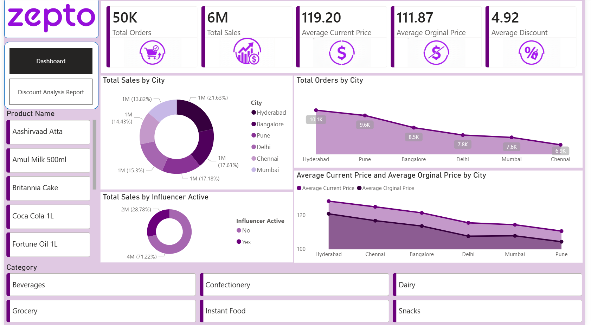
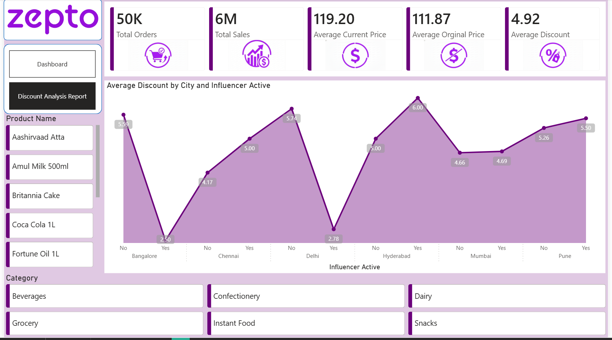

# Zepto Sales Analytics | Power BI Dashboard

An end-to-end **interactive Power BI dashboard** built to analyze Zepto-like sales data and extract business-ready insights.  
The focus is on **data modeling, DAX measures, and decision-driven visualizations** — not just charts.

---

## 📊 Dashboard Overview

### 🔹 Sales & Operations Dashboard

### 🔹 Discount & Influencer Analysis

---

## 🎯 Objectives
- Analyze overall sales and order performance
- Compare **current vs original pricing**
- Understand **city-wise sales & order trends**
- Study **discount behavior**
- Measure the impact of **influencer campaigns**
- Enable product and category-level exploration

---

## 🔍 Key KPIs
- Total Orders  
- Total Sales  
- Average Current Price  
- Average Original Price  
- Average Discount  

---

## 🧠 What Makes This Project Strong
- Clean **data modeling with relationships**
- DAX **measures (not calculated columns)**
- Clear separation between overview and deep-dive analysis
- Business-focused KPIs and visuals
- Fully interactive slicers and filters

---

## 🛠️ Tools & Technologies
- Power BI
- Power Query (Data Cleaning)
- DAX
- Excel / CSV Dataset

---

## 📂 Repository Contents
- Power BI (.pbix) file  
- Dataset  
- Screenshots of dashboards  

---

## 📌 Note
This project is created for **learning and portfolio purposes** using a simulated dataset.

---

If you find this useful or have suggestions, feel free to connect or raise an issue.
